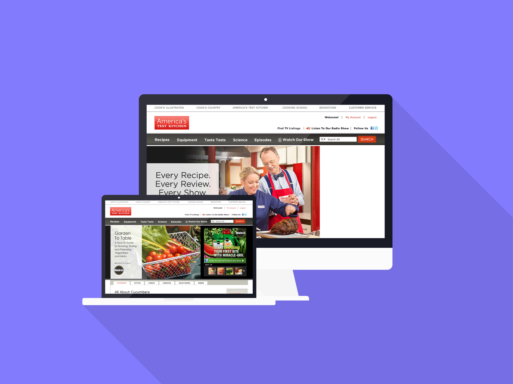

_America&rsquo;s Test Kitchen is a wildly popular cooking television show which has been aired on public television since 2001. At the scale of hundreds of thousands of paid website subscribers and millions of pageviews, there were many unique technological challenges._

## Roles

At America&rsquo;s Test Kitchen I was able to work in a multitude of roles. Starting out I worked mainly as a back-end developer creating web services, objects, and business layer methods.

Later while working there I learned more and more about databases and became proficient with stored procedures, debugging slow database queries using the SQL profiler in Microsoft SQL Server.

[Cook's Country](/projects/cooks-country) is also part of the America&rsquo;s Test Kitchen family, and I was able to work on both sites simultaneously at some times, which presented a challenge since they originally had much different architectures. The team undertook a large project to make them both much more similar with .NET services for the back-end and PHP front-ends using Smarty templates and the CodeIgniter framework.

Towards the end of my time working at America&rsquo;s Test Kitchen, I was able to start working a bit more on the front-end. Nothing major, mainly tweaking existing CSS and Javascript, but it gave me the bug! I loved working on front-end so much that the next job that I took at [Leaf](/projects/leaf) was a front-end developer position.

## Technologies

America&rsquo;s Test Kitchen gave me my first chance to use PHP in a production environment. I learned about modularizing code and making it reusable, as well as .NET WCF and RESTful web services.
