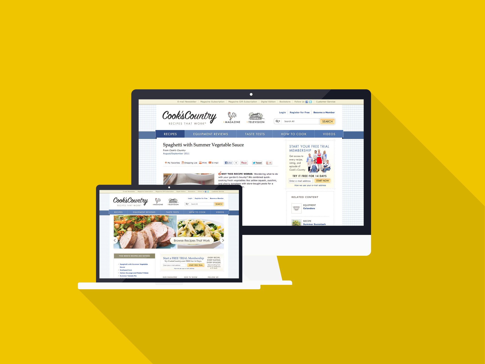

_Cook's Country is a public television show that has aired since 2008. From the creators of America's Test Kitchen_

## Roles

Working on the Cook's Country website was a great chance to learn about MVC patterns, separation of concerns, and PHP frameworks. I worked mostly on the .NET side for this site, including writing web services and viewmodels.

Cook's Country also gave me my first chance to do pair programming with a developer who was more experienced working on the front-end of websites. I was able to learn the basics quickly and fell in love with doing front-end development. We used Sass for CSS precompilation which made creating modular and reusable front-end components much, much easier.

## Technologies

Cook's Country was rebuilt using a PHP framework on the front-end called CodeIgniter with .NET web services and a behance .NET CMS and Microsoft SQL powering the back-end.
