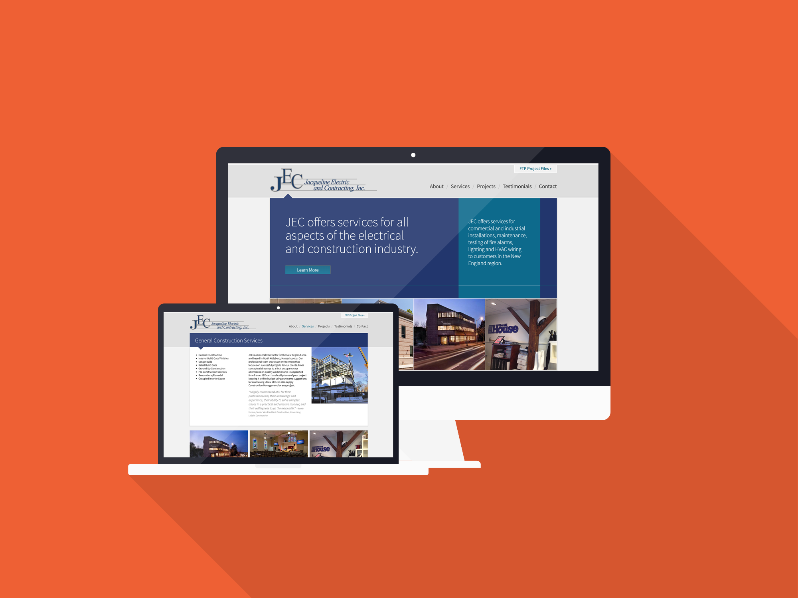

_Jacqueline Electric and Contracting is a small electrical contractor and construction business located in Massachusetts. With many large and high-profile clients, the company wanted a place to show off each of their projects._

## Roles

On this project I worked as a front-end developer creating the custom Wordpress theme and collaborating with the designer (my lovely [wife](http://www.christinemvo.com/)) on designing for Wordpress and the quirks that come with it. Utilizing some wonderful Wordpress plugins and frameworks I was able to build out the site in a manner that wasn't totally horrible (and maybe even a little enjoyable, unlike most of the Wordpress work I had done previously.)

The end product was an easy to update website where the contracting company could easily add or update the projects that they were working on with photos and information.

## Technologies

Jacqueline Electric and Contracting used Wordpress with a fully custom theme based on the wonderful Bones starter template, and the easy-to-use Advanced Custom Fields plugin.
