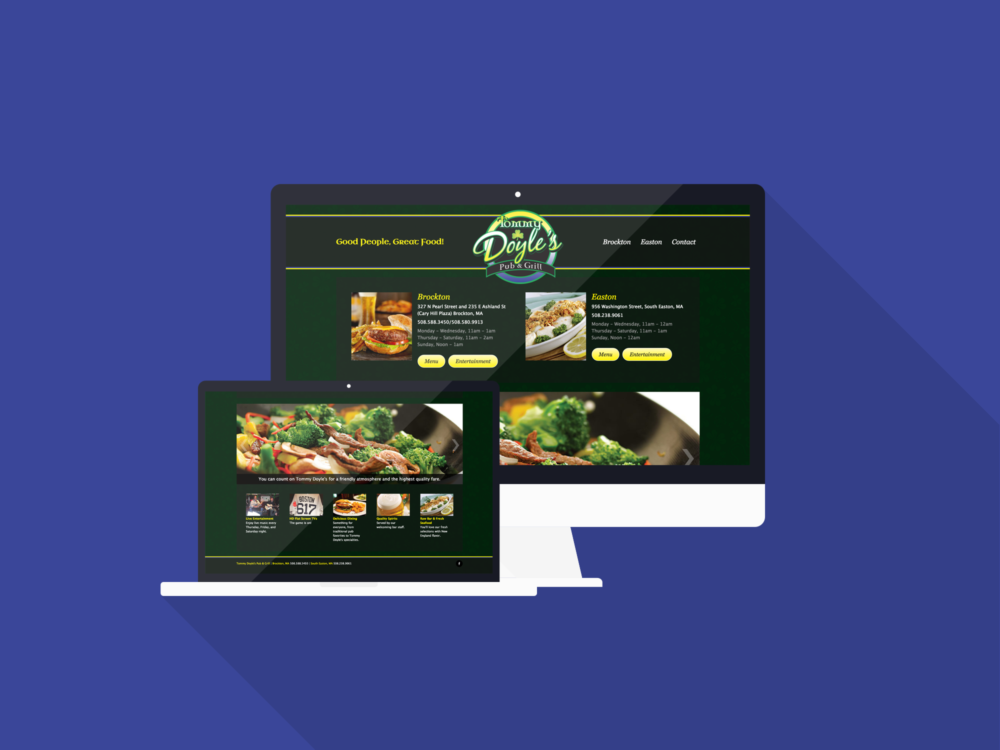

_Tommy Doyle's Pub is a bar and restaurant with 3 locations in the southern part of Massachusetts. Their existing website was a bit dated and lacked the ability to update their menu and post events, so the site was redesigned and built with Wordpress for easy content management._

## Roles

On this project I worked both as a front-end and a pseudo back-end developer. The site used some of the lesser used parts of [Wordpress](/tags/projects/#wordpress) like custom metadata and post types. The theme was again built fully custom to the specifications of the customer.

The end result was a great restaurant website where the owner could easily update their menu items, events, and location information. And no PDF menus to boot, which is a personal pet peeve of mine.

## Technologies

I was able to make this project come to life with the assistance of the great Advanced Custom Fields plugin, which makes it so easy to add additional information to any post in Wordpress. It also used the Bones starter template like most of my projects do.

## Additional Notes

This was my first Wordpress project using the amazing [Timber](http://timberwp.org/) Wordpress framework developed by Jared Novak of [Upstatement](http://www.upstatement.com/). I can't say enough about this, I would never work on a custom theme without it ever again. It implements the well-known MVC patterns and an easy to use templating engine (Twig), something that makes developing Wordpress themes actually enjoyable.
