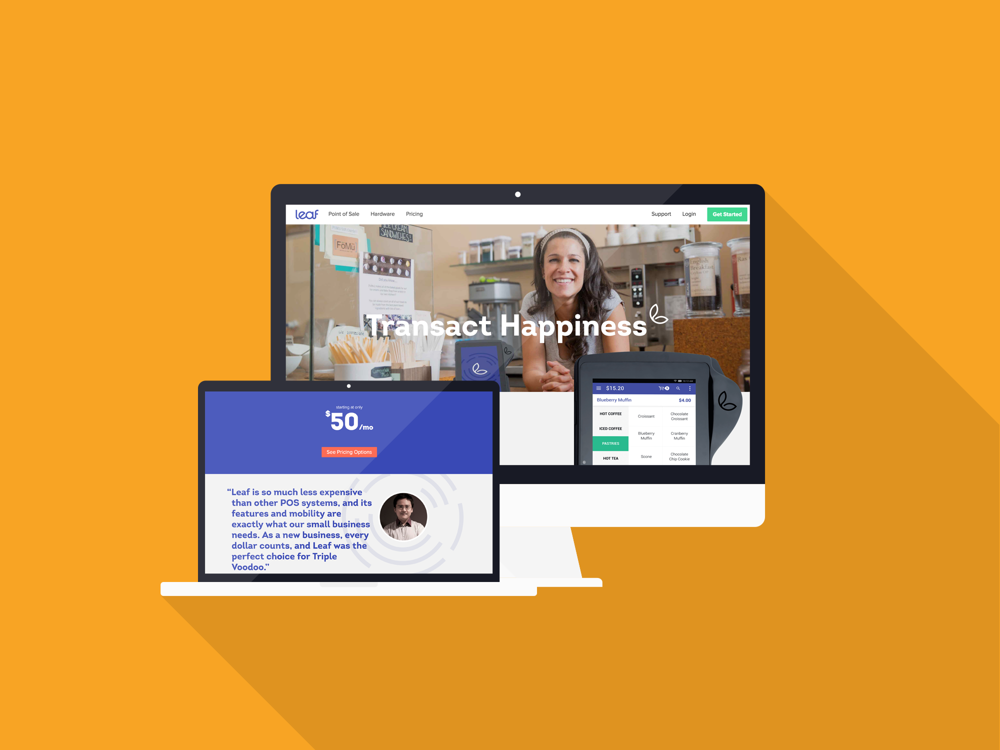

_Leaf was a hardware focused startup located in Cambridge, Massachusetts. The company created a custom Android tablet which served as a point of sale terminal for restaurants and boutique shops. Leaf was acquired by Heartland Payment Systems, and eventually dissolved._

## Roles

I joined Leaf as a front-end developer and focused mainly on the marketing website and blog in the beginning of my time there. The marketing website was a fairly static [Ruby on Rails](/tags/projects/#ruby-on-rails) front-end, with a couple of third party API integrations for maintaining the careers page and customer support assistance.

Even though I joined Leaf as a front-end developer I was able to work on the back-end during my time there as well. This gave me a chance to improve my Ruby on Rails skills by writing and maintaining a Ruby on Rails API to power a JavaScript front-end.

Towards the end of my time there, Leaf decided to pivot their back-end business intelligence product to a payments platform called Leaf Home which would enable third parties to build apps which would run inside of our website, and be able to easily integrate with the payments data we were collecting from our point of sales terminals. This would allow a multitude of things such as weather and holidays to be correlated directly with historical sales data, or integrating accounting software like QuickBooks with the sales data to make the vendor's lives easier. This gave me a chance to use the popular [AngularJS](/tags/projects/#AngularJS) framework in a complex web application.

## Technologies

Building the Leaf marketing site and web app allowed me to explore using Ruby on Rails strictly as an API layer as well as a full-fledged web framework. I also was able to stretch the boundaries of working with AngularJS while building Leaf Home to create a platform which allowed easy integration and ease of access with other third parties.
