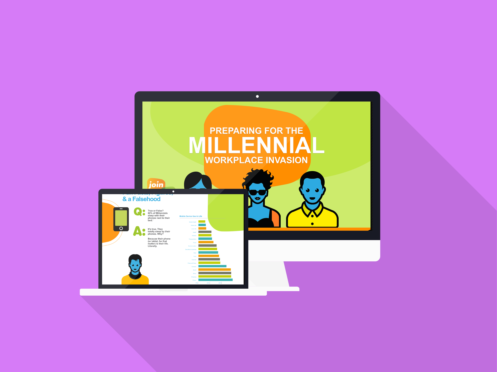

_LogMeIn is a software as a service company founded in 2003 and based in Boston, Massachusetts. The company's join.me software is a freemium online meeting and screensharing product._

## Roles

I acted as the front-end developer and animator on this project. It was a great project not only because I use join.me on a daily or weekly basis but because the design was unique and fun, and the animations were a challenge.

I worked on this project for about a week throughout the different iterations from the designs and client feedback. It was a short lived project, but the final product was well received.

## Technologies

Hand configured SVG and CSS animations were at the heart of this project. This was my first time dealing with serious CSS and SVG animations, especially ones that were triggered by scrolling partially down the page. It was a fun exercise and the end product turned out pretty fun to scroll through.
