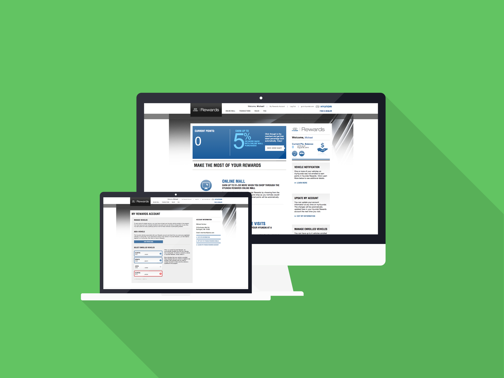

_Hyundai is the fourth largest vehicle manufacturer in the world. Hyundai Rewards is a national effort for Hyundai customers to be able to earn points when servicing their vehicle or buying products. They could then spend these points at multiple places, such as redeeming them for gift cards or products in an online mall, or even towards future service of their vehicle._

## Roles

I worked on the front-end of the Hyundai Rewards site as well as the Rewards Dealer Portal. This was a fully custom build from the ground up. The back-end uses a custom authentication scheme to verify that the user has a myHyundai account before allowing them to access Hyundai Rewards. It also integrates with Hyundai directly to pull a list of the user's vehicles for enrolling into the program. This was all done with a combination of a back-end .NET API and the front-end using KnockoutJS.

The designers worked closely with Hyundai corporate to come up with a theme that matched the existing Hyundai look and feel while also being unique to the Rewards program. I used a responsive grid (Bootstrap) along with Less precompilation to bring the designs to life.

## Technologies

The front-end is a responsive site using a .NET API and KnockoutJS with dynamic data binding and an MVVM pattern. This allowed certain areas of the site to be updated dynamically with data from the API.
