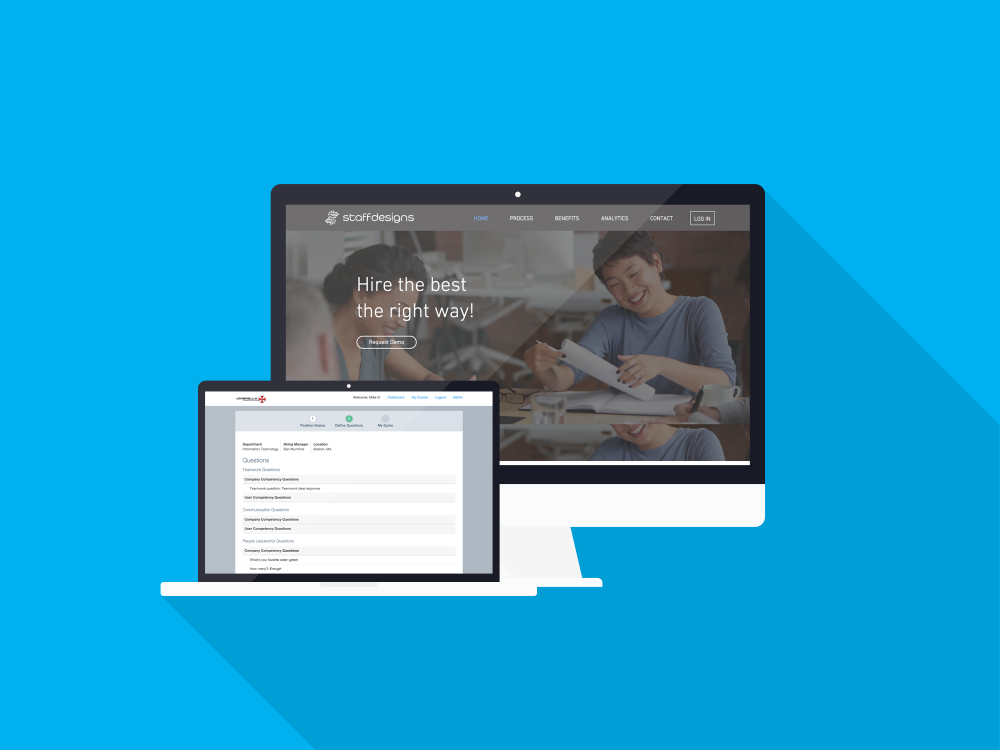

_Staff Designs is a human resources SaaS company aiming to remove the inherent bias from the interview process to streamline and facilitate fair and comprehensive job interviews._

## Roles

During this project I worked as a full-stack developer as well as a project manager. I architected the project from the ground up based on the specifications provided by the client. My [wonderful wife](http://www.christinemvo.com/) was the designer of the project, and the simplicity of the design allows the product to really shine.

Working on this project was a joy because I was free to experiment with technologies I didn't have much experience with such as job queues, [Redis](https://redis.io/), build pipelines, and [Browserify](http://browserify.org/). One of the more interesting things I decided to do with this project was a fully custom asset pipeline implemented in [Gulp](http://gulpjs.com/) which fully replaced the Rails asset pipeline. This allowed more customizability in terms of how exactly things were handled such as caching, minification, and sourcemapping in each step of the build process.

This project also had complex authorization schemes. This was implemented with a combination of back-end policies and front-end views. No data was ever served to the front-end that should not be accessible to the current user based on a complex set of rules governing each individual interview candidate and interviewer.

## Technologies

The project was built in my spare time over the course of about 8 months and used a Ruby on Rails back-end/API, an AngularJS front-end, Redis for caching and job queuing, and Browserify and Gulp as build tools.
