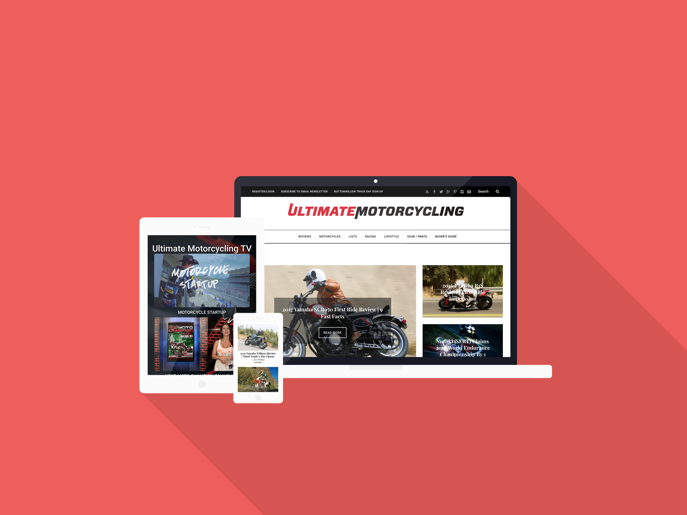

_Ultimate Motorcycling is a popular online motorcycle magazine based in California. They feature high quality content with imagery and videos accompanying each of their informative articles._

## Roles

I worked on many projects for Ultimate Motorcycling such as customizing their theme to be behance to them and fit their exact specifications. I worked alongside the online content editor to ensure his job duties would be easy to perform in the CMS and that their content would be displayed as they expected it to. We also transitioned them to having a fully responsive site so that their content would be easily accessible if the user was using a smartphone or tablet, which has greatly improved the user experience.

Ultimate Motorcycling has recently added a video section to their site of exclusively licensed and homegrown content which is able to be served dynamically from their back-end with a customized version of the Flowplayer plugin which allows them to serve VAST video ads via their existing DoubleClick for Publishers account.

## Technologies

Ultimate Motorcycling uses Wordpress as their CMS, Doubleclick for Publishers to serve their ad content, and VAST video ads served by Flowplayer.
