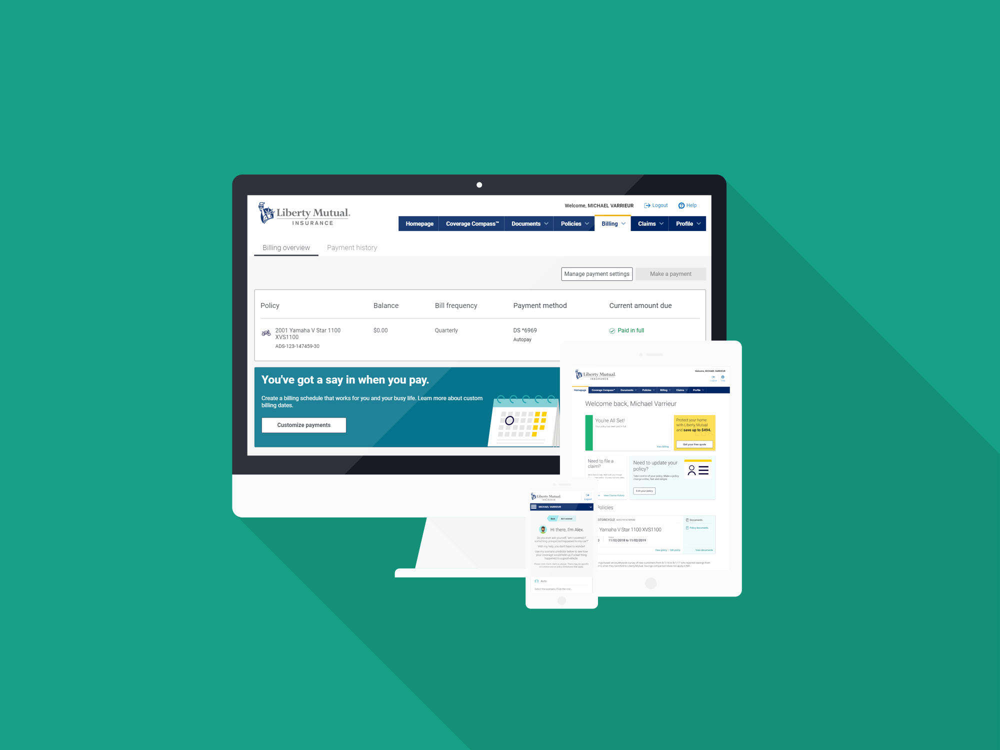

_Liberty Mutual is a Fortune 75 insurance company with over 50,000 employees worldwide._

## Roles

I was hired at Liberty Mutual as part of a large initiative to start to transform their online servicing business to use modern web frameworks. Using the experience I gained while helping my friends with [Meta](/projects/meta) I was able to jump right into the Node back-end and had a ton of fun learning React + Redux for the front-end. During my time I was promoted to Principal Software Engineer leading a team of 8-10 developers and was able to guide the architecture and design principles of the new pages and features we were building.

Liberty Mutual has also started to leverage a distributed Node.js microservice architecture using Docker, Hapi, Apache Kafka, traefik, Apache ZooKeeper, and consul. This allowed for all the separate teams working on services to have a centralized place to publish and subscribe to events while keeping code maintainable and separated.

Liberty was the first place I was able to use React for anything beyond a side project. Using some popular React paradigms and patterns made it really easy to get up to speed quickly and start churning out new features immediately. I really loved the library and the ecosystem surrounding it.

## Technologies

Liberty Mutual uses NodeJS/ExpressJS for the back-end which leverages the existing SOAP and REST services as well as some new Node microservices. The front-end is now written in React leveraging Redux for state management.
